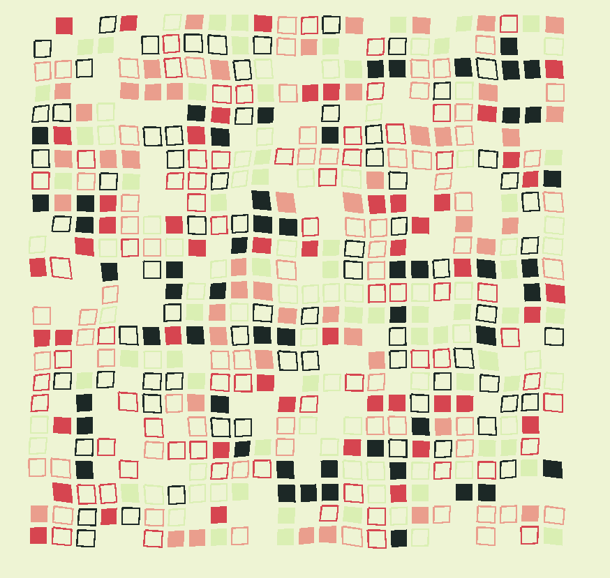

# godot_quad_art

Godot 3.0 implementation of generative art described by Benjamin Kovach in https://www.kovach.me/posts/2018-03-07-generating-art.html

The way Perlin noise is added to the quad vertecies is not the same as in Benjamin's article, but it winds up looking very similar.

GdScript implementation of Perlin noise is from PerduGames: # https://github.com/PerduGames/SoftNoise-GDScript-

There appears to be no antialiasing in 2D in Godot yet: https://github.com/godotengine/godot/issues/12840

